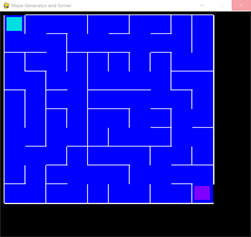
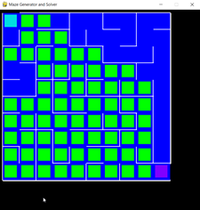
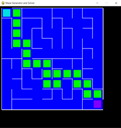

# Maze-Generator-and-Solver
Using Python, I created a Maze Generator and Solver. The maze is generated with the use of disjoint sets, while BFS is used to solve the maze. I used PyGame for the graphics. 

---

#### **Description of the used algorithms**  
##
 ##### __Disjoint Set__ 
Think of a Maze, which consists of N*N cells. Each cell has four walls. In the beginning, no cell is connected to another, which can be represented by a set of singletons **S={{1},{2},{3},...}**. Moreover, the neighbors of a cell can be represented by a set of tuples **E={(1,2),(2,3),...}**.   
##
The algorithm starts with removing a random edge from E. Then the sets of the connected cells are compared. If the sets are disjoint, a union is performed between the two sets, and the wall between them is removed. The algorithm continues, until S becomes a singleton. 
##
 ##### __BFS__
Breadth First Search (BFS) is an algorithm used for searching tree or graph like data structures, which searches for nodes on the same level, and then moves on to the next one. It is expected, that the path searching algorithm will expand with a priority to the left or right, and then up and down. 

---
#### **Installation**

-  I used the module **disjoint_set** from [PyPI](https://pypi.org/project/disjoint-set/). 
 
       pip install disjoint-set

-  **Pygame** was used for the graphics. 
       
       pip install pygame

---
#### **Instructions**    
## 
The main file, takes as arguments the number of rows for the maze, the number of columns for the maze,the starting point, and the finishing point of the maze. 
A starting and finishing point is defined by a tuple of U(UP), D(DOWN), L(LEFT), R(RIGHT) and a number ranging from 0 to n-1, where n is the number of rows or columns.
##  
__Examples__

    python main.py 8 8  U 0 R 7 
    python main.py 4 5  U 0 D 0 

---
#### **Images**
##
- Creating the path  

- Searching the path  

- Finding the path  

